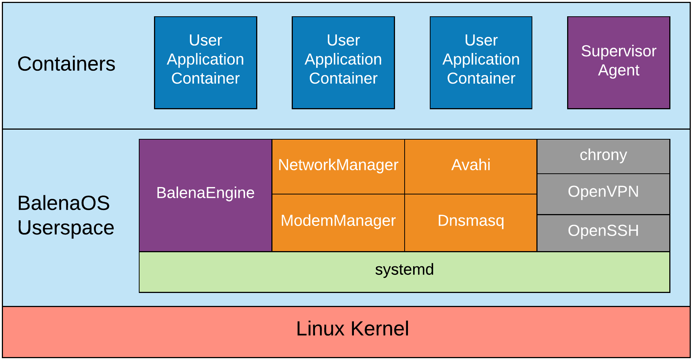
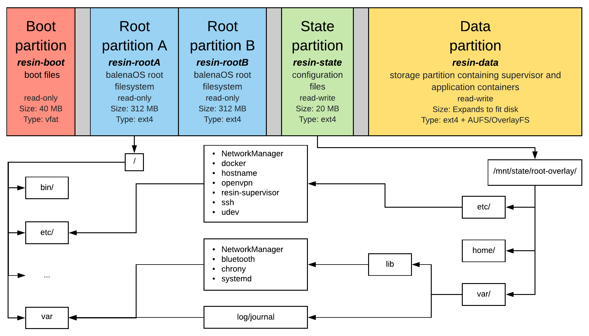

# Architecture Overview

## Introduction

BalenaOS is an operating system optimized for running [Docker](https://www.docker.com/) containers on embedded devices, with an emphasis on reliability over long periods of operation, as well as a productive developer workflow inspired by the lessons learned while building balena.

The core insight behind balenaOS is that Linux containers offer, for the first time, a practical path to using virtualization on embedded devices. VMs and hypervisors have led to huge leaps in productivity and automation for cloud deployments, but their abstraction of hardware, as well as their resource overhead and lack of hardware support, means that they are not suitable for embedded scenarios. With OS-level virtualization, as implemented for Linux containers, both of those objections are lifted for Linux devices, of which there are many in the Internet of Things.

BalenaOS is an operating system built for easy portability to multiple device types (via the [Yocto framework](https://www.yoctoproject.org/) and optimized for Linux containers, and Docker in particular. There are many decisions, large and small, we have made to enable that vision, which are present throughout our architecture.

The first version of balenaOS was developed as part of the balena platform, and has run on thousands of embedded devices on balena, deployed in many different contexts for several years. BalenaOS v2 represents the combination of the learnings we extracted over those years, as well as our determination to make balenaOS a first-class open-source project, able to run as an independent operating system, for any context where embedded devices and containers intersect.

We look forward to working with the community to grow and mature balenaOS into an operating system with even broader device support, a broader operating envelope, and as always, taking advantage of the most modern developments in security and reliability.

## Userspace Components

The balenaOS userspace packages only provide the bare essentials for running containers, while still offering flexibility. The philosophy is that software and services always default to being in a container unless they are generically useful to all containers, or they absolutely can’t live in a container. The userspace consists of many open source components, but in this section, we will highlight some of the most important services.

### systemd

[systemd](https://www.freedesktop.org/wiki/Software/systemd/) is the init system of balenaOS, and it is responsible for launching and managing all the other services. BalenaOS leverages many of the great features of systemd, such as adjusting OOM scores for critical services and running services in separate mount namespaces. systemd also allows us to manage service dependencies easily.

### Supervisor

The Supervisor is a lightweight container that runs on devices. Its main roles are to ensure your app is running, and keep communications with the balenaCloud API server, downloading new application containers and updates to existing containers as you push them in addition to sending logs to your dashboard. It also provides an [API interface](https://www.balena.io/docs/reference/supervisor/supervisor-api/), which allows you to query the update status and perform certain actions on the device.

### BalenaEngine

[BalenaEngine](https://www.balena.io/engine/) is balena's modified Docker daemon fork that allows the management and running of application service images, containers, volumes, and networking. BalenaEngine supports container deltas for 10-70x more efficient bandwidth usage, has 3.5x smaller binaries, uses RAM and storage more conservatively, and focuses on atomicity and durability of container pulling.

### NetworkManager and ModemManager

BalenaOS uses [NetworkManager](https://wiki.gnome.org/Projects/NetworkManager) accompanied by [ModemManager](https://www.freedesktop.org/wiki/Software/ModemManager/), to deliver a stable and reliable connection to the internet, be it via ethernet, WiFi or cellular modem. Additionally, to make headless configuration of the device’s network easy, there is a `system-connections` folder in the boot partition, which is copied into `/etc/NetworkManager/system-connections`. So any valid NetworkManager connection file can just be dropped into the boot partition before device commissioning.

### Avahi

In order to improve the [development experience](https://www.balena.io/docs/learn/develop/local-mode/) of balenaOS, there is an [Avahi](https://wiki.archlinux.org/index.php/Avahi) daemon that starts advertising the device as `balena.local` or `<hostname>.local` on boot if the image is a development image.

### Dnsmasq

[Dnsmasq](https://wiki.archlinux.org/index.php/Dnsmasq) manages the nameservers that NetworkManager provides for balenaOS. NetworkManager discovers the nameservers that can be used, and a binary called `resolvconf` writes them to a tmpfs location, from where Dnsmasq will take over and manage these nameservers to give the user the fastest most responsive DNS resolution.

### chrony

[chrony](https://chrony.tuxfamily.org/) is used by balenaOS to keep the system time synchronized.

__Note__: BalenaOS versions less than v2.13.0 used systemd-timesyncd for time management.

### OpenVPN

[OpenVPN](https://community.openvpn.net/openvpn) is used as the VPN service by balenaOS, which allows a device to be connected to remotely and enabling remote SSH access.

### OpenSSH

[OpenSSH](https://www.openssh.com/) is used in balenaOS as the SSH server and client, allowing remote login using the SSH protocol.

__Note__: BalenaOS versions < v2.38.0 use [dropbear](https://matt.ucc.asn.au/dropbear/dropbear.html) as the SSH server and client

## Image Partition Layout

The first partition, `resin-boot`, holds important boot files according to each board (e.g.m kernel image, bootloader image). It also holds the `config.json` file, which is the central point of [configuring balenaOS](https://www.balena.io/docs/reference/OS/configuration) and defining its behavior. For example, using `config.json`, you can set your hostname, add SSH keys, allow persistent logging, or define custom DNS servers.

`resin-rootA` is the partition that holds the read-only root filesystem; it holds almost everything that balenaOS is.

`resin-rootB` is an empty partition that is only used when the rootfs is to be updated. We follow the A-B update strategy for balenaOS upgrades. Essentially, we have one active partition that is the OS’s current rootfs and one dormant one that is empty. During a balenaOS [update](https://www.balena.io/docs/reference/OS/updates/self-service/) we download the new rootfs to the dormant partition and try to switch them. If the switch is successful, the dormant partition becomes the new rootfs, if not, we roll back to the old active partition.

`resin-state` is the partition that holds persistent data, as explained in the [Stateless and Read-only rootfs](#Stateless-and-Read-Only-rootFS) section.

`resin-data` is the storage partition that contains the Supervisor and application containers and volumes.

## Stateless and Read-Only rootFS

BalenaOS comes with a read-only root filesystem, so we can ensure our host OS is stateless, but we still need some data to be persistent over system reboots. We achieve this with a very simple mechanism, i.e., bind mounts.

BalenaOS contains a partition named `resin-state` that is meant to hold all this persistent data. Inside we populate a Linux filesystem hierarchy standard with the rootfs paths that we require to be persistent. After this partition is populated, we are ready to bind mount the respective rootfs paths to this read-write location, thus allowing different components (e.g., `journald`, when persistent logging is enabled) to be able to write data to disk.

A diagram of our read-only rootfs can be seen below:

## Development vs. Production images

Each version of balenaOS is available in development and production variants, both built from the same source, but with slightly differing feature sets. The development images enable a number of useful features while developing, namely:

* Passwordless [SSH access](https://www.balena.io/docs/learn/manage/ssh-access/) into balenaOS on port 22222 as the root user.
* Docker socket exposed on port `2375`, which allows `balena push` / `build` / `deploy`, that enables remote Docker builds on the target device (see [Deploy to your Fleet](https://www.balena.io/docs/learn/deploy/deployment/)).
* Getty console attached to tty1 and serial.
* Capable of entering [local mode](https://www.balena.io/docs/learn/develop/local-mode/) for rapid development of application containers locally.

__Note:__ Raspberry Pi devices don’t have Getty attached to serial.

Production images disable passwordless root access, and an SSH key must be [added](https://www.balena.io/docs/reference/OS/configuration/#sshkeys) to `config.json` to access a production image.

In both development and production versions of balenaOS, logs are written to an 8 MB journald RAM buffer in order to avoid wear on the flash storage used by most of the supported boards.

To persist logs on the device, enable persistent logging by setting the `"persistentLogging": true` [key](https://www.balena.io/docs/reference/OS/configuration/#persistentlogging) in `config.json`. The logs can be accessed via the host OS at `/var/log/journal`. For versions of balenaOS < 2.45.0, persistent logs are limited to 8 MB and stored in the state partition of the device. balenaOS versions >= 2.45.0 store a maximum of 32 MB of persistent logs in the data partition of the device.

## OS Yocto composition

BalenaOS is composed of multiple [Yocto](https://www.yoctoproject.org/) layers. The Yocto Project build system uses these layers to compile balenaOS for the various [supported devices](/os/docs/supported-boards/). Below is an example from the [Raspberry Pi family](https://github.com/balena-os/balena-raspberrypi/blob/master/layers/meta-balena-raspberrypi/conf/samples/bblayers.conf.sample).

__Note:__ Instructions for building your own version of balenaOS are available [here](/os/docs/custom-build/#Bake-your-own-Image).

| Layer Name                                 | Repository                                                                                 | Description                                                               |
|--------------------------------------------|--------------------------------------------------------------------------------------------|---------------------------------------------------------------------------|
| poky/meta                                  | https://git.yoctoproject.org/cgit/cgit.cgi/poky/tree/meta                                  | Poky build tools and metadata.                                            |
| poky/meta-poky                             | https://git.yoctoproject.org/cgit/cgit.cgi/poky/tree/meta-poky                             |                                                                           |
| meta-openembedded/meta-oe                  | https://github.com/openembedded/meta-openembedded/tree/master/meta-oe                      | Base layer for OpenEmbedded build system.                                 |
| meta-openembedded/meta-filesystems         | https://github.com/openembedded/meta-openembedded/tree/master/meta-filesystems             | OpenEmbedded filesystems layer.                                           |
| meta-openembedded/meta-networking          | https://github.com/openembedded/meta-openembedded/tree/master/meta-networking              | OpenEmbedded networking-related packages and configuration.               |
| meta-openembedded/meta-python              | https://github.com/openembedded/meta-openembedded/tree/master/meta-python                  | Layer containing Python modules for OpenEmbedded.                         |
| meta-raspberrypi                           | https://github.com/agherzan/meta-raspberrypi                                               | General hardware specific BSP overlay for the Raspberry Pi device family. |
| meta-balena/meta-balena-common             | https://github.com/balena-os/meta-balena/tree/development/meta-balena-common               | Enables building balenaOS for supported machines.                         |
| meta-balena/meta-balena-warrior            | https://github.com/balena-os/meta-balena/tree/development/meta-balena-warrior              | Enables building balenaOS for Warrior supported BSPs.                     |
| balena-raspberrypi/meta-balena-raspberrypi | https://github.com/balena-os/balena-raspberrypi/tree/master/layers/meta-balena-raspberrypi | Enables building balenaOS for chosen meta-raspberrypi machines.           |
| meta-rust                                  | https://github.com/meta-rust/meta-rust                                                     | OpenEmbedded/Yocto layer for Rust and Cargo.                              |

At the base is [Poky](https://www.yoctoproject.org/software-item/poky/), the Yocto Project's reference distribution. Poky contains the OpenEmbedded Build System (BitBake and OpenEmbedded-Core) as well as a set of metadata.  On top of Poky, we add the collection of packages from meta-openembedded.

The next layer adds the Board Support Package (BSP). This layer provides board-specific configuration and packages (e.g., bootloader and kernel), thus enabling building for physical hardware (not emulators).

The core code of balenaOS resides in the meta-balena-common layer. This layer also needs a Poky version-specific layer (e.g., meta-balena-warrior) based on the requirements of the BSP layer.

Next is the board-specific meta-balena configuration layer. This layer works in conjunction with a BSP layer. For example, the Raspberry Pi family is supported by the meta-raspberrypi BSP layer and the corresponding meta-balena-raspberrypi layer configures balenaOS to the Raspberry Pi's needs

The final meta-rust layer enables support for the rust compiler and the cargo package manager.

__Note:__ Instructions for adding custom board support may be found [here](/os/docs/custom-build/#Supporting-your-Own-Board).
